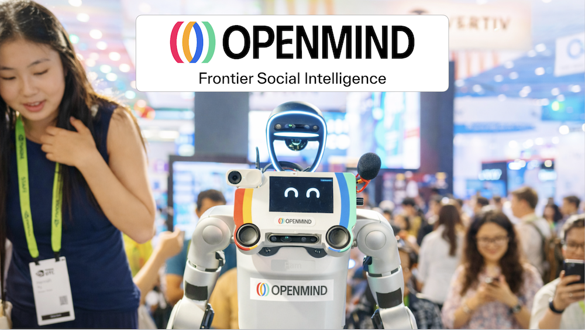
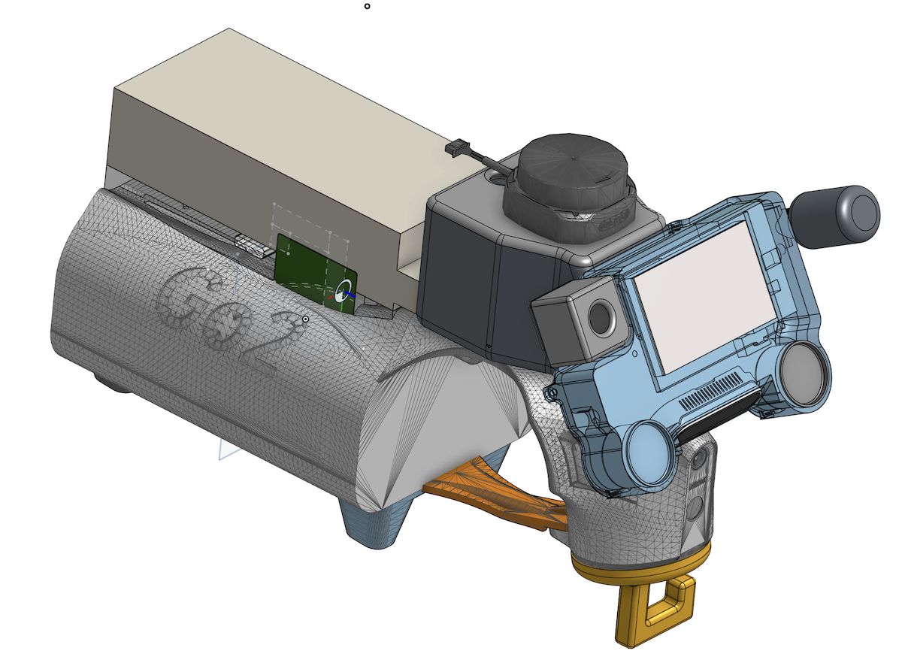

# BrainPack for Unitree G1, Unitree Go2, and LimX Tron 1

## Introduction

The **BrainPack** provides an easy to use, modular compute and development platform for robotics, integrated with the Unitree G1, Unitree Go2, and LimX Tron 1 (and other robots, coming soon). 

Included in the design are sensors and outputs that allow your robot to understand and react to its environment and interact with humans. The BrainPack with [Nvidia Thor](https://developer.nvidia.com/blog/introducing-nvidia-jetson-thor-the-ultimate-platform-for-physical-ai/) can connect to OpenMind cloud endpoints for voice, spatial navigation, emotion generation, teleops, and other robot functionality. 

The purpose of the BrainPack is to empower rapid iteration and experimentation. It enables developers to explore vertical-specific solutions quickly, re-configuring the system efficiently to meet evolving research or customer needs.

## Cross-Platform - It's Wooftacular!



## The Challenges in Robotics Development and Deployment

Currently, many robotics platforms are limited to academic research, single industrial problems, or for use as toys. When organizations attempt to deploy these robots into more complex and more realistic environments, significant limitations quickly become apparent.

### Hardware Limitations 

Common pain points include weak loudspeakers, lack of USB ports for additional sensors, lack of a touchscreen, lack of directional microphones, and outdated secondary computing modules. This means that even when purchasing a sophisticated robot such as Unitree G1, to conduct basic experiments and product development substantial time and effort must be spent on specialized cabling, 3D-printed parts, and add-on sensors.

### Fragmentation and Scalability

The robotics landscape is massive and highly fragmented. With over 400 active companies developing diverse robotic platforms and form factors, one impediment is the lack of hardware standards for integrating or swapping key components — whether that involves sensors, computing power, or power distribution. Imagine if your desktop PC were composed entirely of custom parts and you could not assemble the computer from standardized parts to fit your unique needs.

This forces developers into a difficult cycle: when a solution is built, it cannot be easily deployed across different robot brands and physical forms. This inefficiency means development efforts are tied to single-brand and single form factors. The BrainPack provides a standardized interface, establishing a common layer of capability that allows software and intelligence to run across multiple robot hardware platforms.

### Data Security and Privacy

For real world use of robots, it is important that humans feel comfortable in their presence, and this suggests physical privacy switches on cameras and microphones, as are standard for consumer webcams for example. The BrainPack allows cameras and microphones to be physically unplugged, or replaced with models that have privacy switches. Another feature commonly missing from most robots are indicator lights showing when cameras and microphones are active. 

### Our Solution: The BrainPack

We developed the BrainPack to address these blocks. This modular system provides deployment flexibility by providing one architecture that makes it easy to integrate, adapt, and explore diverse use cases. 

## Features

- **Designed for OM1** - Optimized for running OM1.
- **Human in the Loop** - Teleops - control your robot remotely or request help from another human whenever you need (via portal.openmind.com).
- **Developer Friendly** - Modular design with multiple connections and ports for easy hardware integration.

## Documentation

- [Bill of Materials](./docs/Materials.md)
- [CAD Files](./CAD/)
- [Assembly Instructions](./docs/Assembly.md)

## Repository Structure

```
PRISM/
├── README.md
├── docs/
│   ├── Materials.md       # Bill of Materials
│   └── Assembly.md        # Assembly Instructions
├── CAD/
    └──                    # STL files for 3D printing
```

## License

This project is licensed under the terms of the **MIT License**, which is a permissive free software license that allows users to freely use, modify, and distribute the software. 

The MIT License is a widely used and well-established license that is known for its simplicity and flexibility. By using the MIT License, this project aims to encourage collaboration, modification, and distribution of the software.

---
