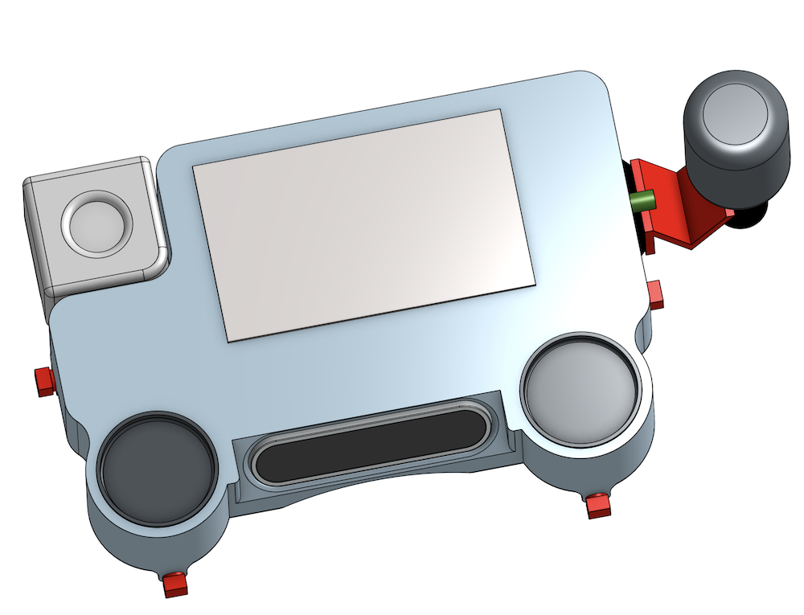
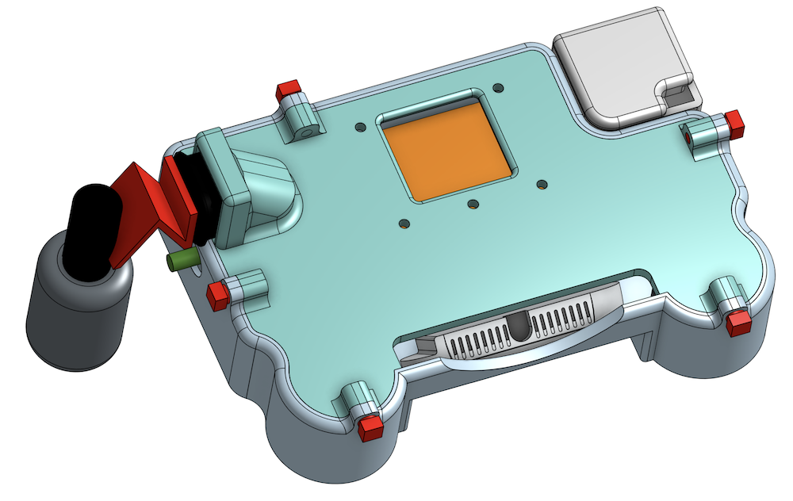
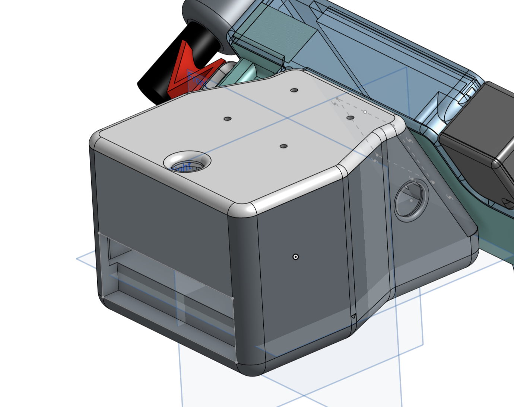
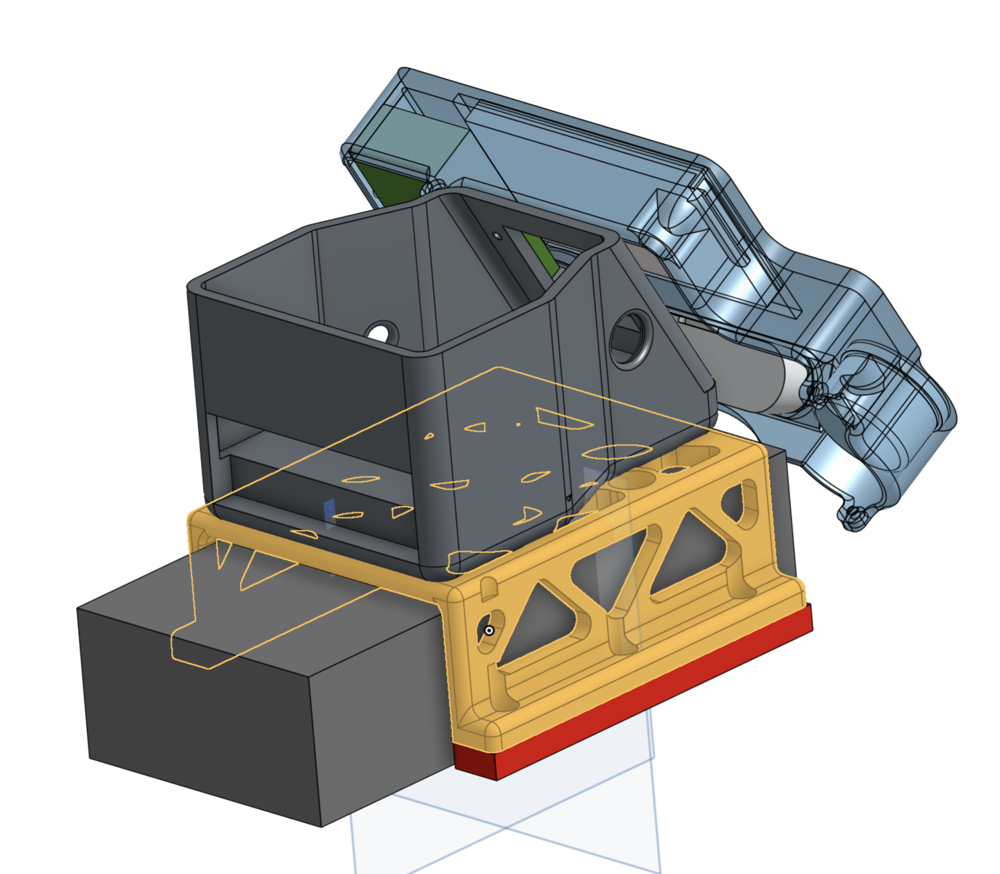
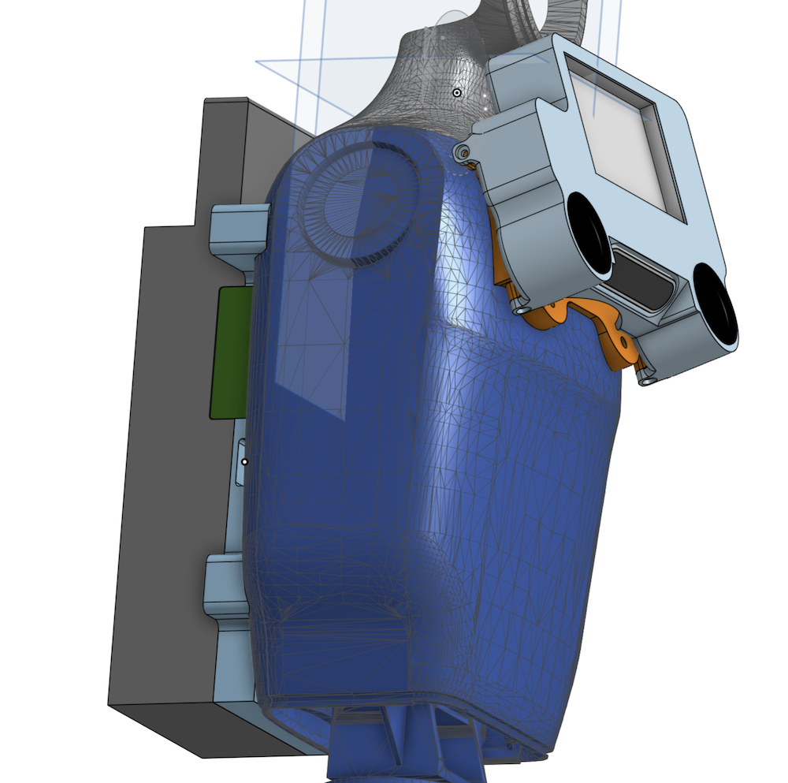

<!-- TOC start (generated with https://github.com/derlin/bitdowntoc) -->
- [1. Safety](#safety)
   * [1.1 DANGER: Power Budget and Thermal Limits](#danger-power-budget-and-thermal-limits)
   * [1.2 DANGER: Robot Stability](#danger-robot-stability)
- [2. Materials](#materials)
   * [2.1 Display Unit ("Face")](#display-unit-face)
   * [2.2 Face and Sensor Carrier ("Head"); LiDAR](#face-mounting)
      + [2.2.1 Unitree G1](#unitree-g1)
      + [2.2.2 Unitree Go2 and LimX Tron 1](#unitree-go2-and-limx-tron-1)
   * [2.3 Thor Cradles](#thor-cradles)
      + [LimX Tron 1](#limx-tron-1)
      + [Unitree G1](#unitree-g1-1)
      + [Unitree Go2](#unitree-go2)
- [3. Cables and Power](#cables-and-power)
   * [3.1 Thor Power Harness](#thor-power-harness)
   * [3.2 Power Electronics](#power-electronics)
      + [LimX Tron 1 Power Cable](#limx-tron-1-power-cable)
      + [Unitree G1 Power Cable](#unitree-g1-power-cable)
      + [Unitree Go2 Power Cable](#unitree-go2-power-cable)
   * [3.3 Power Budget](#power-budget)
      + [Powered USB Hubs](#powered-usb-hubs)
      + [Example Power Calculation for Entire System](#power-budget-total)

<!-- TOC -->
# BrainPack Materials

> NOTE: Refer to the Bill of Materials with approximate build cost [here](https://docs.google.com/spreadsheets/d/1YjTzyw0XH3A2SuCKs4Oi_q3m2KCcntqwOuZ239gBQtQ/edit?gid=0#gid=0).
> Prices can vary based on supplier, region, availability, and where generic items are purchased.

<!-- TOC -->
## 1. Safety

<!-- TOC -->
### 1.1 DANGER: Power Budget and Thermal Limits

**Without proper design and measurement, it can easily happen that you operate a robot above its design power budget, which is dangerous. For safe use, you must carefully consider the robot's intended use, average and peak power requirements, the robot's physical environment (e.g. external air temperature, exposure to direct sun), and the power/thermal interplay of simultaneous movement, sensing, and compute.** 

Unless you get this right, you may experience fast battery drain, intermittent faults and resets, electrical shorts and fires, overheating, poor sensor performance and many other possible problems. 

**Example 1**: when a robot tries to speak (at max volume) and walk at the same time, while also running multiple large policies, this could overload (and reset) the power system. The humanoid will then suddenly crash to the floor. Testing individual robot subsystems in isolation will not surface this problem, which only occurs when the robot wishes to move, think, and speak at the same time.

**Potential Solution**: Prepare a power budget based on actual measurements of average and peak power draws. An inline **USB Voltage Current Power Tester Multimeter** (such as the [FNB58USB Voltage/Current/Power tester/monitor](https://www.fnirsi.com/products/fnb58)) is useful to measure the actual power draw of your sensors and other electronics payload in their final configuration. If needed, change how you are powering your computers and sensors, such as by moving loads to other power buses, providing powered USB hubs, or adding external batteries (but see [below](#danger-robot-stability)).

**Example 2**: The robot performs flawlessly in an air conditioned lab, but falls over frequently when deployed in a hot sunny environment. In this case, different joints are probably overheating, switching the system to emergency damp mode, resulting in a fall and subsequent damage to the robot. 

**Potential Solution**: ensure that your software monitors the temperature and power draw of all joints. If your software detects operation near the thermal limits, warn human and robot bystanders and train your small-brain subsystem to then perform a safe sink-to-floor action with an audible alarm and flashing light. A better long term solution is for the robot to autonomously seek shade or an air conditioned room prior to overheating.

**Example 3**: The robot performs flawlessly when it is not moving, but when it is navigating in even a small space, you notice an overall degeneration of WiFi and an angular dependence of WiFi signal strength, resulting in erratic performance for teleops (which relies on good video and audio). Teleops fails when the robot is walking North (or some other specific direction) but works well then the robot turns around and sits down. 

**Explanation and Potential Solution**: The Nvidia Thor dev kit contains an internal Wi-Fi 6E module and its two antennas are located inside the dev kit, at the bottom of the "back" of the unit. If you mount the Thor on the back of the Unitree Go2, these two antennas will be close to the dog's power electronics and the two hip motors. In addition, depending on how the robot is pointing, the antennas at the lower back of the Thor can be occluded relative to the WiFi base station. We recommend adding an high-quality omnidirectional WiFi antenna to a high point of your robot and then connecting it to the AW-XB560NF via custom I-PEX MHF4 terminated coax. Rewiring the internals of the Nvidia Thor Dev kit is somewhat involved and exceeds the scope of this introductory write up. 

<!-- TOC -->
### 1.2 DANGER: Robot Stability

**CAUTION: adding extra mass (such as external computers, sensors, grippers, and batteries) to the robot will affect your motion policies and the robot's stability and ability to navigate terrain. You may for example observe the robot swaying back and forth while simply trying to stand. Solution: train custom motion policies for your robot in its final mass configuration.**

<!-- TOC -->
## 2. Materials

<!-- TOC -->
### 2.1 Display Unit ("Face")

| Name | Quantity |  Link | 
|------|---|----------|
| Face Bezel                           | 1 | [stl](../CAD/Universal_Face/UniFace.stl) | 
| Face Back (Unitree Go2, LimX Tron 1) | 1 | [stl](../CAD/Universal_Face/FaceBack.stl) |
| Face Back (Unitree G1)               | 1 | [stl](../CAD/Universal_Face/FaceBack_G1.stl) | 
| Widefield Camera Box                 | 1 | [stl](../CAD/ArduCam_FishEye/CameraEnclosure.stl) |
| Widefield Camera Box, Lid            | 1 | [stl](../CAD/ArduCam_FishEye/CameraLid.stl) |

**<ins>1 ea. Flexible HDMI to HDMI Cable</ins>** This is used to connect the Thor to the LCD screen. Suggested part: Twozoh Flexible HDMI to HDMI Cable Right Angled 90° 1FT Ultra Thin and Slim HDMI Cord Support 3D/4K@60Hz
- For Unitree G1 and Go2: 1FT length: https://www.amazon.com/dp/B09XHYH4KY
- For LimX Tron 1: 3.3FT length: https://www.amazon.com/dp/B09XHZD6Z2

**<ins>1 ea. Fisheye RGB Camera</ins>** Suggested part: Arducam 1080P Low Light WDR Ultra Wide Angle USB Camera Module 2MP CMOS IMX291 160 Degree Fisheye Mini UVC USB2.0 SKU: B0202 [Purchasing link](https://www.arducam.com/arducam-1080p-low-light-wdr-ultra-wide-angle-usb-camera-module-for-computer-2mp-cmos-imx291-160-degree-fisheye-mini-uvc-usb2-0-spy-webcam-board-with-microphone-3-3ft-cable-for-windows-linux-mac-os.html)

**<ins>1 ea. RealSense Depth Camera (D435i)</ins>** Intel RealSense Depth Camera D435i, Silver 1080p Video Capture Resolution (82635D435IDK5P) https://www.amazon.com/Intel-RealSense-Depth-Camera-D435i/dp/B07MWR2YJB

**<ins>2 ea. Powered USB Hub</ins>** 4 Port USB 3.2 Gen 1 Micro Powered Hub PCBA w/ VL817 Chipset & ESD Surge Protection (CG-817X4AX1C-PD-PCBA) https://www.coolgear.com/product/4-port-usb-3-2-gen-1-micro-powered-hub-pcba-w-esd-surge-protection. This hub accepts 7 to 14V via a 2.5mm barrel jack. 

**<ins>2 ea. Barrel Power Jack, Male</ins>** Generic part, many suppliers. Suggested part: SDTC Tech 3 Sets 5.5 x 2.5 MM 10A DC Power Jack Socket Threaded Female Mount Connector Adapter & 12V Male DC Power Pigtail Cable with Dustproof Plug https://www.amazon.com/dp/B0B6FFN4V5 

**<ins>1 ea. High-Brightness Touch Screen</ins>** Waveshare 5 inch High-Brightness Touch Screen, 1024x600 Pixels Toughened Glass Panel, HDMI Interface, IPS Panel SKU: 27960 Mfr. #: 5DP-CAPLCD-H https://www.waveshare.com/5dp-caplcd.htm?sku=27960

**<ins>1 ea. Audio Amplifier</ins>** DROK 15W+15W 2.0 2pcs 12V Amplifier Board, Dual Channel Audio Amplifier Board PAM8620 DC 8-26V Digital Stereo Amp Module Class D Mini Power https://www.amazon.com/dp/B0CQJRL235 **Design notes**: Working voltage: DC8~26V, 15W stereo (24V 8ohm)/ 10W stereo (12V 8 ohm), if connect 4 ohm or 2 ohm speaker, the power will be automatically limited to 15W. Calculation: We are powering with 12V. Assuming auto limiting to 15W per side, aka (12V/15W =) 1.25 A per channel, the combined max power draw is limited to 1.25 + 1.25 = 2.5A, with overhead that works out to ~3A. 

**<ins>2 ea. Speaker 42mm 8W 4ohm</ins>** Mouser #: 665-AS04204PR Mfr. #: AS04204PR Mfr.: PUI Audio https://mou.sr/4sO2Qsp. These are 4 ohm speakers. The DROK audio amplifier will auto limit power to 15W per side (which overloads the speakers, leading to distortion, so do not turn the volume up all the way). 

**<ins>1 ea. Audio Cable</ins>** Seadream 3.5mm Aux Cable Short 2Pack 8 inch 3Port 3.5mm Right Angle Male to Male Stereo Audio Cable https://www.amazon.com/dp/B01L0YPVOY

**<ins>1 ea. Sound Card ADC and DAC</ins>** SABRENT USB External Stereo Sound Adapter USB-A (do not buy USB-C version - degraded audio quality) https://www.amazon.com/dp/B00IRVQ0F8

**<ins>1 ea. Directional Microphone</ins>** Comica Camera Microphone, CVM-VM10II Directional Microphone Cardioid Shotgun Video Camcorder Microphone https://www.amazon.com/dp/B0748CYPDJ **Design notes**: retain included 3.5 mm TRS cable; will be used in final assembly

**<ins>1 ea. Microphone Mount</ins>** SMALLRIG Cold Shoe Mount Adapter with 1/4 Thread Hole – 1241 https://www.amazon.com/dp/B00HJFBUCQ

**<ins>5 ea. M3 Threaded Inserts for 3D Printing Components</ins>** Many suppliers, for example: Kadrick 520Pcs M2 M3 M4 M5 Threaded Inserts Assortment Kit for 3D Printing Components Metric Brass Knurled Nuts https://www.amazon.com/dp/B0D5V3TZLB

**<ins>5 ea. M3 x 8mm Thread Pitch Cap Screws</ins>** Many suppliers, for example: Iexcell 100 Pcs M3 x 8mm Thread Pitch 0.5 mm Stainless Steel 304 Hex Socket Button Head Cap Screws Bolts Kit https://www.amazon.com/dp/B08H2HTTRT

#### USB Cables

**<ins>1 ea. USB Cable for RealSense</ins>** Suggested part: SUNGUY USB C 3.1 Gen 2 USB A 0.3m (B104-0.3m). This cable is commonly sold as a 1FT cable; the total length of this cable (all inclusive) is actually 13 1/4 inches. This is a good length to run from the RealSense to the powered USB hub inside the head unit. https://www.amazon.com/dp/B0B28ZCV2Y

**<ins>1 ea. USB Cable for Touchscreen Data/Power</ins>** Suggested part: Aceyoon 90 Degree USB C Cable 0.6ft Short Right Angle Type C https://www.amazon.com/dp/B096VYVR17

**<ins>2 ea. USB Cable for Hub to Thor</ins>** Suggested part: SUNGUY USB C 3.1 Gen 2 USB A 0.15m. These cables are a good length to run from the powered USB hubs to the Nvidia Thor. https://www.amazon.com/dp/B0CTMSCQQW

**Design Notes**: The RPLidar S2 comes with two short USB-A cables, which can be used without modification. The SABRENT USB-A sound card does not need a cable. The Arducam comes with a USB-A cable but it is far too long so it needs to be replaced with a custom cable which is easy to fabricate manually.  

<!-- TOC -->
### 2.2 Face and Sensor Carrier ("Head"); LiDAR

| Robot  | Name | Quantity | Link |
|--------|------| --- |----------|
| Unitree Go2, LimX Tron 1 | Face and Sensor Carrier ("Head") | 1 | [stl](../CAD/Universal_Face/Head.stl) |
| Unitree Go2, LimX Tron 1 | Face and Sensor Carrier, Lid     | 1 | [stl](../CAD/Universal_Face/HeadLid.stl) |

<!-- TOC -->
#### 2.2.1 Unitree G1

To mount the face to the Unitree G1, you will need M6 cap screws and lock nuts.

**2 ea. M6 x 25mm Cap Screws** with nylon lock nut. Generic part, many suppliers.

The Unitree G1 is supplied with an internal [Livox Mid360](https://www.livoxtech.com/mid-360). Please refer to the Unitree and Livox documentation for information on the Mid360.  

<!-- TOC -->
#### 2.2.2 Unitree Go2 and LimX Tron 1

To mount the face to the **Face and Sensor Carrier ("Head")**, which is what mounts to the Unitree Go2 and the LimX Tron 1, you will need M3x16mm cap screws and M3 lock nuts.

**4 ea. M3 x 16mm Cap Screws** with nylon lock nuts and washers. Generic part, many suppliers. 

**1 ea. RPLidar S2 - ToF LiDAR** 360 Degree Laser Range Scanner, 2D, 30-meter range, sunlight resistant, 10Hz (600rpm), 32kHz sample rate (angular resolution is 0.1125°). https://www.slamtec.com/en/s2

Once all the electronics/wiring has been completed, close the head with the lid. The lid also serves as the base of the [RPLidar S2 - ToF LiDAR](https://www.slamtec.com/en/s2). The RPLidar is mounted to the lid with 4ea. M3 x 8mm cap screws - the same ones that are used to connect the face unit to the face back.

<!-- TOC -->
### 2.3 Thor Cradles

| Robot | Name | Quantity | Link |
|-------|------|---|----------|
| Unitree G1  | Cradle with holdplates | 1 | [stl](../CAD/Unitree_G1) |
| Unitree Go2 | Cradle with holdplates | 1 | [stl](../CAD/Unitree_Go2) |
| LimX Tron 1 | Head Mount (Thor cradle equivalent) | 1 | [stl](../CAD/LimX_Tron1/HeadMount_withThorCutout.stl) |

<!-- TOC -->
#### LimX Tron 1

**1 ea. M5 T Slot Nut and Bolt Kit** Many suppliers, for example: 200Pcs 2020 Aluminum Extrusion M5 T Slot Nuts and Bolts Screws 20 Series Extruded Hardware Drop in T Nut Slide Nut M5x8 10mm for 20/20 80 20 2040 T V Slot Black Aluminum Profile Accessories https://www.amazon.com/dp/B08VGSNT2S

<!-- TOC -->
#### Unitree G1

**2 ea. Nylon Holding Strap** Fastening Hook and Loop Cable Straps, 10 Pack Black Self-Adhesive Cable Ties, Nylon Securing Straps with Buckles Adjustable and Reusable Cinch Straps for Cords Organized and Tidy(1" x 20") https://www.amazon.com/dp/B088FJCJDL

**2 ea. M6 x 35mm Cap Screws** Generic part, many suppliers. These are used to secure the TOP of the Thor cradle. 

**2 ea. M6 x 30mm Cap Screws** Generic part, many suppliers. These are used to secure the BOTTOM of the Thor cradle.

<!-- TOC -->
#### Unitree Go2

**1 ea. Nylon Holding Strap** Fastening Hook and Loop Cable Straps, 10 Pack Black Self-Adhesive Cable Ties, Nylon Securing Straps with Buckles Adjustable and Reusable Cinch Straps for Cords Organized and Tidy (1" x 20") https://www.amazon.com/dp/B088FJCJDL

**2 ea. M3 x 35mm Cap Screws** with washers. Generic part, many suppliers. These are used to secure the FRONT of the Thor cradle to the back of the dog.

**2 ea. M3 x 50mm Cap Screws** with washers. Generic part, many suppliers. These are used to secure the BACK of the Thor cradle to the back of the dog. 

<!-- TOC -->
## 3. Cables and Power

The Nvidia Thor is typically powered with:

* 4S 14.8V external LiPo (Unitree G1)
* 28 to 33.6V main robot power bus (Unitree Go2)
* 24V main robot power bus (LimX Tron 1)

The different robots have different power plugs:

* Unitree G1 - 24V/5A plug, XT30 connector - can be used for the audio amplifier directly (which accepts anything below 26V). You can use the XT30UPB-F 12V 12V/5A power output to power a USB hub. 
* Tron 1 - 24V, XT60 connector - can be used for the audio amplifier directly (which accepts anything below 26V) **AND** the Nvidia Thor. You will need a MATEKSYS BEC 12S to generate 12V to power the USB hubs.
* Unitree Go2 - 28 to 33.6V, XT30 connector - can be used for the Nvidia Thor **AND** via a step-down (buck) regulator, the audio amplifier and the powered USB hubs.

**NOTE: In general, you will need to design, fabricate, and assemble a custom step-down regulator which (1) takes 24 to 34V and (2) provides 12-17V for the audio amplifier and 5V 2A for the LCD screen back-lighting. In an emergency, you can use 2 ea. MATEKSYS BEC 12S Pro Synchronous switching step-down regulators, or equivalent, but this is probably not ideal.**

<!-- TOC -->
### 3.1 Thor Power Harness

Thor Power Cable, MICRO-FIT3.0 R-S 4 CIRCUIT 600MM 
DigiKey #: 900-2147561043-ND Mfr. #: 2147561043 
https://www.digikey.com/en/products/detail/molex/2147561043/12180337 

<!-- TOC -->
### 3.2 Power Electronics

| Robot  | Name |
|--------|------|
| All | MICRO-FIT3.0 R-S Thor Power Cable |
| All | Mil-spec hookup wire, M22759/16-20 Mil-Spec Tefzel Hi-Temp Stranded Wire 20AWG Gauge, Black |
| All | Mil-spec hookup wire, M22759/16-20 Mil-Spec Tefzel Hi-Temp Stranded Wire 20AWG Gauge, Red |
| All | Crimp butt connectors, heat shrink, associated tooling |
| All | 2.5 mm Barrel Jack connectors |
| Unitree Go2 and G1 | Male XT30 connector with wire leads |
| Unitree Go2 | MATEKSYS BEC 12S Pro 9-55V to 5/8/12V-5A Synchronous switching step-down (buck) regulator | 
| Tron 1 | Male XT60 connector with wire leads |
| Unitree G1 | Male EC5 connector with 14AWG wire leads |
| Unitree G1 | 120S 14.8V 10000 mAh LiPo battery with female EC5 connector and LiPo charger |
| Unitree G1 | CAMWAY 5PCS 2 in 1 1-8s LiPo Battery Low Voltage Buzzer Alarm |

<!-- TOC -->
#### LimX Tron 1 Power Cable

The Tron 1 provides 24V through an XT60 jack. The Tron 1 does not need a power converter to power the audio amplifier or the Thor, but does need a MATEKSYS BEC 12S to provide 12V to the USB Hubs. Add a drop of solder to short the 12V config pins of the BEC 12S so that it provides 12V rather than the default 5.2V. Use crimp butt connectors to connect the male XT60 plug to the MICRO-FIT3.0 (for the Thor), the MATEKSYS BEC 12S, and the power input to the audio amplifier. **You will damage the audio amplifier, the Thor, the robot, or all three, if you get this wrong. Do not reverse the polarity!**  

<!-- TOC -->
#### Unitree G1 Power Cable

The Unitree G1 **does not** provide sufficient power for both the Thor and the audio amplifier. Therefore, an external LiPo battery is needed to power the Thor. The G1 just powers the audio amplifier (via the 24V/5A XT30) and the powered USB hub (via the G1's 12V/5A XT30).

1. Connect (using crimp butt connectors, cover with mil-spec glue coated heat shrink) a male XT30 connector to the audio amplifier cables (red, black) from the face unit. Plug the XT30 plug into the **MIDDLE** G1 power supply, which provides 24V/5A. **You will damage the audio amplifier, the G1, or both, if you get this wrong. Do not reverse the polarity!** 

2. Connect (using crimp butt connectors, cover with mil-spec glue coated heat shrink) a male XT30 connector to the barrel jack connector which will power the USB hub. Plug the XT30 plug into the **RIGHT** power port, which provides 12V/5A. **You will damage the hub, the G1, or both, if you get this wrong. Do not reverse the polarity!** 

3. Connect (using crimp butt connectors, cover with mil-spec glue coated heat shrink) a Male EC5 connector to the MICRO-FIT3.0 R-S Thor power connector. This connector has 4 wires, two of which will be used for ground, and two of which will be used for 14.8V. Consult the Thor technical documentation to determine the correct wiring. **You will damage the Thor if you get this wrong. Do not reverse the polarity! WARNING FIRE HAZARD: Do not short the 120S 14.8V 10000 mAh LiPo battery!**  

4. Use a second Velcro nylon strap to attach the LiPo battery to the Thor cradle. Connect the _Lipo Battery Low Voltage Buzzer Alarm_ to the balance port of the LiPo battery to avoid damaging the LiPo battery due to over-discharge. **WARNING BATTERY DAMAGE: Do not fully drain the LiPo battery. The Thor will try to drain the battery below 13.6V, which will damage it and prevent further charging. Recharge the battery when it has discharged to 13.6V.**

<!-- TOC -->
#### Unitree Go2 Power Cable

The Unitree Go2 provides 28 to 33.6V, which is too much for the audio amplifier and the powered USB hubs. Solution: use a MATEKSYS BEC 12S Pro Synchronous switching step-down (buck) regulator to provide 12V to the audio amplifier and USB hubs. 

1. Connect (using crimp butt connectors, cover with mil-spec glue coated heat shrink) a male XT30 connector to **BOTH** the MICRO-FIT3.0 (for the Thor) and the power input of the MATEKSYS BEC 12S power buck. Add a drop of solder to short the 12V config pins of the BEC 12S so that it provides 12V rather than the default 5.2V. Connect the outputs of the BEC 12S to the red/black wires from the audio amplifier in the face unit and the barrel jack connectors for the powered USB hubs. **You will damage the audio amplifier, the Thor, the robot, or all three, if you get this wrong. Do not reverse the polarity!** 

2. Plug the XT30 plug into the 33.6V Go2 power supply port, after convincing yourself that you did not reverse the polarity in your cabling.

**WARNING HIGH CURRENTS: Assuming you are operating the Thor at its "MAX" setting and using a full set of sensors, the payload could use as much as 300W. The current rating for the Go2 power ("Output power interface DC28.8V") is not publicly documented (if you know what it is, please let us know). However, we have been able to draw 8A.**   

<!-- TOC -->
### 3.3 Power Budget

We recommend a [FNB58USB Voltage/Current/Power tester/monitor](https://www.fnirsi.com/products/fnb58) to measure actual power draw.

**USB Bus A** This must be externally powered 
USB-A Power for RPLidar S2 Laserscan - Operating Current: 40mA (sleep); 400mA (working, official datasheet); 340mA (working, measurement) 
USB-A Data for RPLidar S2 Laserscan - Operating Current: 40 mA (working, measurement) 
USB-A Microphone and Speaker ADC and DAQ - time sensitive data - Microphone only with Comica actual current 24 mA 
USB-A LCD Display power - Operating Current: 130mA (in sleep); 900mA (full power back-lighting) 

**USB Bus B** This should be externally powered 
USB-C RealSense - USB 3.1 critical - Operating Current: 60mA (sleep); 130mA (working, RGB only); 700 mA (working, peak, per datasheet) 
USB-A Arducam - normal video data rates, USB 2.0 ok - Operating Current: 210mA (working, measurement) 

<!-- TOC -->
#### Powered USB Hubs

For reliable and stable performance **you must use powered USB hubs**. We recommend **<ins>4 Port USB 3.2 Gen 1 Micro Powered Hub PCBA w/ VL817 Chipset & ESD Surge Protection (CG-817X4AX1C-PD-PCBA)</ins>** https://www.coolgear.com/product/4-port-usb-3-2-gen-1-micro-powered-hub-pcba-w-esd-surge-protection. This hub accepts 7 to 14V via a barrel jack connector: DC Barrel 2.5mm ID × 5.5mm OD, Center Pin Positive. This hub can provide 20W total power or 900 mA per port. You can obtain 12V from a MATEKSYS BEC 12S (or equivalent). The MATEKSYS BEC 12S can provide 5A (continuous) and 9A (peak) output. 

<!-- TOC -->
#### Example Power Calculation for Entire System

**Audio** Assume you are powering the audio amplifier with 12V and have connected 2 8W speakers. Assuming auto limiting to 15W per side, aka (12V/15W =) 1.25 A per channel, the combined max power draw is limited to 1.25 + 1.25 = 2.5A, with overhead that works out to 3A. 

**Powered USB Hub 1** 1.2 amp draw

**Powered USB Hub 2** 0.9 amp draw

Assuming you are powering the USB hubs with 12V, then assume 2.1A total draw. With the 12V audio system, that gives 2.1 + 3 = 5.1A worst case draw, which (just barely) can be handled by one BEC 12 (which is rated for 5A continuous and 9A peak). 

<!-- TOC -->
## 4. Reliable Networking

The Nvidia Thor dev kit contains a Wi-Fi 6E module (AzureWave AW-XB560NF IEEE 802.11ax (Wi-Fi 6/6E) and Bluetooth 5.3/5.4 combo module). The two antennas are located inside the dev kit. The antennas can be occluded depending on how the dev kit is mounted on your robot and how your robot is moving and angled relative to the WiFi base station. We recommend adding an omnidirectional WiFi antenna to your robot, and then connecting it to the AW-XB560NF via custom I-PEX MHF4 terminated coax. Rewiring the internals of the Nvidia Thor Dev kit is somewhat involved and exceeds the scope of this introductory write up. 
